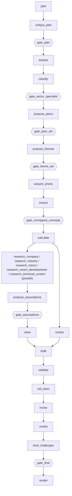
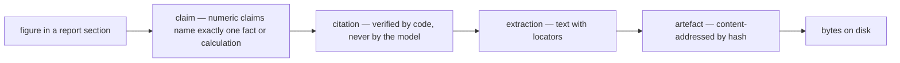

# Knowledge map

*The orientation layer. Read this first, before `docs/plan/ROADMAP.md` (the authority on
scope), before the ADRs (the record of decisions), and before the code. It is written for a capable
Python developer who has never seen this repository and needs to make a safe change in their
first week.*

*This document routes; it does not restate. Where it names a fact that can drift — the step
list, the module inventory, the ADR references — `tests/test_knowledge_map.py` pins that
fact to the code, so a change that invalidates the map fails the suite rather than quietly
outliving it.*

---

## 1. The one rule

Everything in this system follows from a single split, stated in `CLAUDE.md` and decided in
ADR 0003:

**Deterministic Python owns every number and every fact. The language model owns planning,
interpretation, comparison, adversarial challenge and writing.**

| Deterministic code | Language model |
|---|---|
| Fetching, hashing, caching, parsing | Research planning |
| **All arithmetic** — ratios, WACC, DCF, comps | Assumption *proposal*, with justification |
| Unit and currency handling | Source relevance triage |
| Date arithmetic, point-in-time selection | Drafting sections from structured facts |
| Citation resolution and verification | Red-teaming the thesis |
| Schema validation, storage, cost metering | Natural-language writing |

Most wrong changes to this codebase are wrong by moving something across this line — a
calculation drifting into a prompt, or a model output being trusted as a fact. When
reviewing a change, ask which column each new behaviour belongs to.

## 2. The anatomy of one run

A **run** is the system's unit of work: one research request in, one cited report out. The
row it hangs off is a `work_orders` row, not a `research_requests` one (ADR 0072): who asked,
what the run may spend, what date its evidence is judged against and whether it is archived
are properties of a *run*, and since migration `0064` they live on that table alone. The
equity mandate is a detail row sharing the work order's primary key, reached through
`services/mandate.py` — which answers `None` for a run that is not about one listed company,
and that `None` is a real answer rather than a missing row.

The production workflow is `vertical_slice_v1` (`src/aer/workflow/workflows/vertical_slice_v1.py`,
`build_steps()`); the engine that executes it is `src/aer/workflow/engine.py`. Steps are
recorded, resumable, and independently budgeted; **gates** pause the run for a human.
Resuming is a first-class act (ADR 0090): `aer resume` re-enqueues the *same* job after a
failure with the decision appended to the audit chain, `aer step` walks a run one step at
a time (`jobs.step_mode` pauses it `PAUSED` after every executed step), and `aer diagnose`
prints each step's recorded readout without spending anything.

What to know per step, beyond the diagram:

| Step | Owner | Spends money? | Notes |
|---|---|---|---|
| `plan` | `agents/planner` | yes (~£0.15) | Proposes sections and sources; never findings |
| `critique_plan` | `agents/plan_critic` | yes (~£0.30 with a revision) | Attacks the plan before gate 1; one planner revision at severity ≥ 3 (ADR 0091) |
| `gate_plan` | `services/approvals` | no | First of the two gates every run passes |
| `acquire` | `services` + `sources/sec` or `sources/uk` | no | Filings fetched, hashed, stored |
| `classify` | `services` | no | Filing types; may trigger the sector gate |
| `propose_peers`, `acquire_prices` | `sources/eodhd` | no (API quota, not model spend) | Conditional on the EODHD subscription |
| `propose_themes` | `agents/themes` | yes (~£0.02) | K1, ADR 0065: a bounded slate; a failed call proposes nothing |
| `gate_theme_set` | `services/approvals` | no | Conditional; skipped on an empty slate |
| `extract` | `extract/` | no | Bytes → text with locators; iXBRL/PDF/HTML |
| `calculate` | `calc/` via `services` | no | Statements, ratios, quality — all traced |
| `research_*` (five, parallel) | `agents/worker` | yes (~£0.10 each) | Tool *requests* executed by code (ADR 0036); `web_search` returns a listing, metered per search (ADR 0092) |
| `comps` | `calc/comps` | no | Withholds rather than publishes licensed rows |
| `propose_assumptions` | `agents/assumptions` | yes (~£0.20) | Only the two numbers no filing answers (ADR 0046) |
| `gate_assumptions` | `services/approvals` | no | The one gate that approves work not yet done |
| `value` | `calc/wacc`, `calc/dcf` | no | Runs only on confirmed assumptions |
| `draft` | `agents/section_writer`, `sections/` | **yes (~£5, the largest)** | One call per model-written section; see ADR 0052 |
| `validate` | `verify/`, `agents/validator` | small | Deterministic checks; the model only *advises* (ADR 0038) |
| `red_team` | `agents/red_team` | yes (~£1) | Attacks the draft from a separate context (ADR 0039) |
| `revise` | `services/revision` | yes (~£1.50 at the bound) | Redrafts the sections material challenges attack, once, then seals the gate-2 hash (ADR 0091). A redraft that does not pass leaves the approved draft standing (ADR 0098) |
| `verdict` | `agents/verdict` | yes (~£0.01) | One sentence of interpretation over the frozen draft (ADR 0087); no payload, no hash, never evidence |
| `brief_challenges` | `agents/challenge_brief` | yes (~£0.02) | What each side of an unsettled challenge assumes and implies, and which way it leans (ADR 0095); advisory, and reaches no report |
| `gate_final` | `services/approvals` | no | Second universal gate; shows scores, not promises |
| `render` | `render/`, `charts/` | no | Stored sections → document; a chart is a figure (ADR 0043) |

Money: every estimate above is a **guard input**, not a forecast — the engine refuses to
start a step whose projected cost breaks the per-run or monthly ceiling, and a step with no
estimate is invisible to that guard (ADR 0052 records how that was learned). Actual spend is
metered per call into the `costs` table and never recomputed.

## 3. The provenance chain

This chain is the product. Every mechanism in the codebase exists to keep it unbroken:

The three properties that hold it together:

- **Only code confirms a citation** (ADR 0018). The model may propose one; verification
  re-reads the artefact by hash and checks the excerpt is really there
  (`tests/test_citations.py`).
- **A locator points into an extraction, not into bytes** (ADR 0017), so a parser upgrade
  cannot silently move every citation.
- **Calculations carry their own provenance**: formula, inputs each with unit and source,
  and code version (`calc/engine.py`, `tests/test_calc_provenance.py`). A figure with no
  chain behind it cannot reach a report — the numeral scan in `core/section_output.py`
  refuses it.

## 4. Module inventory, by trust zone

Under `src/aer/`. The zones matter more than the alphabet: a change inside a stricter zone
carries stricter obligations.

**Zone 1 — the correctness core (pure, `mypy --strict`, no I/O, no clock, no globals):**

| Module | One line |
|---|---|
| `core` | Pure domain types and logic: enums, schemas, section-output checks, skill policy |
| `calc` | Every number the platform produces: units algebra, traced engine, statements, ratios, quality, WACC, DCF, comps, FX, prices, bridge |

`calc` is where property-based tests (`hypothesis`) are expected and where mutation sweeps
have been run deliberately (gap analysis A24, A26). `Decimal` throughout; a unit mismatch
raises, never coerces (`tests/test_units.py`).

**Zone 2 — the guarded doors (one way in or out, enforced):**

| Module | One line | Enforcement |
|---|---|---|
| `fetch` | The only component permitted outbound network requests: SSRF guard, robots, rate limits, pinned-IP transport | socket-blocked test suite; ADR 0009 |
| `providers` | The only door to a language model; `providers/anthropic` is the only module importing the SDK | `tests/test_providers.py::TestTheImportBoundary` scans the source tree |
| `storage` | Content-addressed, immutable artefact store | `tests/test_artefact_store.py`; ADR 0008 |

**Zone 3 — the model-facing layer (contains prompts; everything it returns is checked in code):**

| Module | One line |
|---|---|
| `agents` | The roles a model performs: planner, workers, assumptions, section writer, custom section, validator advisory, red team. Capability comes from a registry, never from a subclass; a new role requires an ADR (ADR 0035, `agents/registry.py`) |
| `skills` | User-authored skill files: additive-only — a skill can add requirements, never relax them, proved by a corpus that must all fail (ADR 0040) |

**Zone 4 — orchestration and services:**

| Module | One line |
|---|---|
| `workflow` | The engine and the workflow definitions: recorded, resumable steps, budget guard, gates |
| `services` | Business operations between HTTP and the database |
| `sources` | One adapter package per publisher: `sec`, `uk` (Companies House), `eodhd`, `macro` (ALFRED/ECB), plus issuer discovery and tiering |
| `extract` | Archived bytes → text a citation can point at |
| `verify` | Deterministic checks deciding whether claims are supported |
| `eval` | The guarantees as numbers with thresholds; a blocking CI gate (`just eval`) |
| `render` | Stored sections → document |
| `charts` | Deterministic Matplotlib; a chart is a figure with the same provenance duties (ADR 0043) |
| `sections` | Report sections resolved from data, not code (ADR 0013) |
| `obsidian` | One-directional projection of approved data into a vault |

**Zone 5 — the shell:**

| Module | One line |
|---|---|
| `api` | Application factory, dependencies, error handling, routers |
| `web` | Server-rendered Jinja2 + HTMX GUI (ADR 0006) |
| `db` | Engine, sessions, ORM models, Alembic migrations |
| `cli` | Typer entry points: serve, backup/restore, verify-artefacts, replay-run, purge-licensed … |
| `worker` | The arq background worker where a run actually executes |
| `queue` | Enqueueing a run from the web process (deliberately separate from the worker) |
| `runtime` | Assembles the service bundle both processes share |
| `config` | Typed settings (`AER_*` env vars, `.env`); credentials are `SecretStr` |
| `errors` | `AerError` subclasses, each with a stable `code` |
| `logging` | Structured logs with name- and shape-based secret redaction (a backstop, not a licence) |
| `tracing` | Optional OpenTelemetry spans; off unless configured, can never fail a run (ADR 0049) |
| `version` | Build identity |

## 5. The invariants, and what enforces each

The eight non-negotiables from `CLAUDE.md`, with their teeth. Weakening one of these is an
ADR-level decision, not a code change.

| # | Invariant | Enforced by |
|---|---|---|
| 1 | Every externally derived fact traces to a hashed artefact | `storage/` + `tests/test_artefact_store.py`; `aer verify-artefacts` re-hashes the store |
| 2 | The model may propose a citation; only code confirms one | `verify/` + `tests/test_citations.py` (ADR 0018) |
| 3 | No figure reaches a report unless it is a stored fact or recorded calculation | `core/section_output.py` numeral scan + `sections/evidence.py` closed-world id checks |
| 4 | Point-in-time is enforced at acquisition, in code | `sources/sec` selection (ADR 0010: selection, not filtering) + `tests/test_sec_pit.py` |
| 5 | Units are carried through all arithmetic; mismatch raises | `calc/units.py` + `tests/test_units.py`, both operand orders |
| 6 | Cost is metered and capped in code | `providers/costs.py`, `workflow/engine.py` BudgetGuard + `tests/test_budget.py` (ADRs 0051, 0052) |
| 7 | Skill files are additive-only | `core/skill_policy.py` + the ADR 0040 corpus (`tests/skill_corpus.py`) |
| 8 | Untrusted content is data, never instruction | `agents/untrusted` wrapping + tool authorisation in code (`tests/test_injection.py`, ADR 0036) |

## 6. Where the decisions live: the ADR index, by theme

The ADRs (`docs/adr/`) are chronological; questions are thematic. Routes for the common
ones — read the ADR before touching its territory:

- **Money and metering** — 0012 (provider abstraction), 0015 (the vendor contract is
  asserted, not assumed), 0048 (prompt caching: what repeats goes first), 0051 (the month
  is UTC's and the cap does not join), 0052 (a step with no estimate is a step with no cap),
  0053 (a call is capped in pounds, not in tokens).
- **Evidence and provenance** — 0008 (content-addressed artefacts), 0010 (point-in-time is
  selection), 0014 (what may change after the fact), 0017 (locators), 0018 (only code
  confirms a citation), 0021 (look-ahead checked twice), 0024 (the evidence chain is a
  surface), 0031 (erasure is an appended event), 0044 (an aggregate is dated by its newest
  component), 0055 (evidence reaches a section ranked, and a thin report says so), 0058 (a
  dimensioned fact is a different observation), 0061 (evidence is scoped to the subject, not
  to the request), 0062 (a fiscal year belongs to the period, not to the filing), 0063 (a
  claim about how a number was produced is a claim about a calculation), 0069 (a scheduled
  filing is a date, not a catalyst), 0086 (a cited calculation must be the one the sentence
  quotes).
- **Calculation** — 0003 (the one rule), 0011 (unit-safe and traced), 0026 (FX ships the
  rate), 0027 (per cent is a convention), 0028 (a sensitivity grid is eighty-one
  valuations), 0029 (the sector block is a type), 0032 (the adjusted close is not a
  column), 0034 (a withheld figure is a type with no field for it), 0066 (a figure that is
  traceable is not thereby possible), 0068 (the ledger records derivations, not calls),
  0070 (a bank is valued on the spread over its book value), 0101 (a bank's grid varies the
  spread, and a fading driver is refused rather than shifted), 0102 (a thesis is premises,
  and a premise is the judgement), 0103 (the monitor measures the crossing, and the model
  reads the rest), 0104 (a decision is written before the outcome, and the trade points back
  at it), 0105 (a review is proposed by the reviewer and held by the operator), 0106 (risk
  is measured over the weights the book holds now, and a scenario is a shock the operator
  states), 0107 (a watchlist is followed continuously and researched as at a date).
- **Agents and containment** — 0035 (a new role requires an ADR), 0036 (workers request,
  code executes), 0037–0039 (custom sections, validator advises, red team is separate),
  0040 (containment proved by a corpus), 0041 (dry runs), 0042 (the section writer holds
  no tools), 0046 (assumptions: only what no filing answers), 0059 (a model proposes peers
  and the registry resolves them), 0064 (prior research may shape the questions, never the
  answers), 0065 (themes are proposed, confirmed, and only then edges), 0067 (a proxy may be
  proposed only if it names itself as one), 0103 (the thesis monitor: code measures the
  crossing, the model's status is bounded by it, and a finding is closed by an act with a
  reason).
- **Interface and presentation** — **start here before changing a screen.** 0006 (the GUI is
  server-rendered HTML, progressively enhanced with htmx), 0077 (JavaScript may own chrome
  and never a figure — and what a provenance badge is), 0056 (house style is configuration
  applied at render), 0013 (report sections are data, not code), 0023 (the disagreement
  ladder decides, or says it cannot), 0024 (the evidence chain is a surface, not a schema),
  0043 (a chart is a figure), 0054 (a reference numeral is provenance, not a figure), 0057
  (a count is not a figure and a clause is not a section), 0060 (a number inside a name is
  not a figure), 0096 (a malformed claim costs the claim, not the section), 0097 (a numeral
  is checked against the figure, not against its spelling), 0098 (a refused revision leaves
  the approved draft standing), 0099 (three degradations are three numbers, not one),
  0100 (a repeated gap remark costs the remark, not the section),
  0087 (a verdict has two halves:
  one composed, one authored), 0088 (a
  fixed-scheme region carries its own measured palette), 0089 (the run you are watching has an
  address).
  **Read 0006 and 0077 together before designing anything.** 0006 decides that the server is
  the only renderer; 0077 narrows the islands permission 0006 left open and draws the line
  the whole interface sits behind — chrome may be the client's, a figure never is. The
  design brief in [`../design/`](../design/README.md) restates both as constraints a
  designer can work against.
- **Data sources and licensing** — 0020 (pdfplumber alone), 0022 (FCA NSM declined), 0030
  (EODHD route 2), 0045 (the euro is the pivot because the Bank of England is closed).
- **Security** — 0009 (egress is deterministic and guarded), 0019 (detection is not the
  defence), 0033 (a credential in a URL is invisible to name-based redaction), 0050
  (settings are editable, credentials are not).
- **Operations and testing** — 0016 (a run publishes itself), 0025 (the gate found the
  verifier wrong), 0047 (a memory cap is a one-way door), 0049 (tracing is off until asked).
- **The Investment OS expansion** — the platform growing from one research tool into several,
  planned in `docs/archive/investment-os.md`. 0071 (a tool is a registered capability, not a package),
  0072 (a work order is the run root), 0073 (an attestation is what the book says), 0074 (a
  judgement is never a source reference), 0075 (the portfolio clock is not the research
  clock), 0076 (a lineage node resolves by table), 0077 (JavaScript may own chrome and never
  a figure), 0078 (a monitor finding is not a gated decision), 0079–0081 (the thesis monitor,
  the risk analyst, the post-trade reviewer), 0082 (a rate is a dated observation with a
  source, not a number in a column), 0083 (a position is a calculation, not a row), 0084 (a
  rate outlives the request that fetched it), 0085 (cost basis is a pooled average, and not
  a tax computation).
  **Read 0073 and 0074 together before touching any portfolio table**: they are what stops a
  number the operator typed and a view the operator holds from becoming interchangeable.
  **Read 0083 before writing one**: it says which tables exist, and `positions` is not one
  of them.

## 7. Extension recipes

Nearly every future change is one of these five. Each has an existing pattern; the sixth
way is the wrong way.

> **One thing is deliberately not a sixth recipe.** Adding a whole *tool* — a portfolio, a
> trade journal — is a different class of change, not a shortcut around the five. The five
> extend the research tool from inside, and each one inherits a subject, a run, a budget and
> a gate that already exist. A tool brings its own. That is why it is settled by ADR 0071
> rather than listed here, and why it is the only kind of change that adds a row to
> `INSTALLED_TOOLS`. If what you are building fits one of the five, it is not a tool.

**Add a built-in report section.** Sections are data, not code (ADR 0013): a
`section_definitions` row (seeded by migration), an output contract, an evidence policy in
`sections/`. The generic writer, renderer and provenance walk pick it up; no new agent.

**Add a calculation.** A pure function in `calc/`, `Decimal` in and out, `@traced` so its
formula and inputs persist, property tests in the matching `tests/test_*.py`, and a golden
case if it feeds the evaluation gate. Never a default parameter in `calc/wacc.py` or
`calc/dcf.py` — absence must be loud.

**Add a data source.** An adapter package under `sources/` implementing the
`SourceAdapter` protocol, fetching only through `aer.fetch`, with a ToS/robots
determination recorded in an ADR *before* the first request — two sources (FCA NSM, BoE)
were declined at that step, and that outcome must stay reachable.

**Add an agent role.** A `RoleDefinition` in `agents/registry.py` (tools, output
ceiling, output contract) plus the ADR the registry test demands, and a route in
`config.py`'s `DEFAULT_MODEL_ROUTES`. Capability lives only in the registry; a subclass
declaring its own is refused at class definition. There is deliberately no input-token
allowance to set — a call is bounded by the model's context window and by money, per call
(ADR 0053).

**Add or change a skill.** User-authored Markdown with validated frontmatter; the
additive-only composer intersects its requests against what the role already holds. If a
skill needs a capability the platform lacks, that is a platform change first.

## 8. The negative space

Deliberate absences. Each looks like an oversight until you read its reasoning; each has
been re-litigated at least once already, which is why it is recorded here.

- **No Bank of England adapter.** The Bank documents a CSV route its own `robots.txt`
  disallows; reaching around that is circumvention. The euro is the pivot instead
  (ADR 0045) — and the **GBP risk-free rate is therefore still missing**: sterling is not
  discounted at a US Treasury yield, so `risk_free_series_for("GBP")` refuses.
- **No FCA NSM fetching.** ToS determination against it (ADR 0022).
- **No Langfuse / external tracing vendor.** OpenTelemetry spans exist behind a setting;
  a collector nobody can run is a dependency nobody can trust (gap A13, ADR 0049).
- **No per-role input-token allowances.** They existed, and a live run died on one that a
  big company's evidence legitimately outgrew. Every call is now priced in pounds at the
  provider boundary against the run's own budget and the month's — which also closed
  ADR 0052's open consequence, since the calls *inside* a step are each guarded now. The
  only token-shaped bound left is the routed model's context window (ADR 0053).
- **The numeral rule stays strict** (gap A32, open). Dates, CIKs and exhibit numbers in
  prose trip it and are recovered by retry. Relaxing it moves invariant 3's boundary and
  needs an ADR and an operator decision. What it does *not* do is compare spellings: a
  numeral is checked against the **value** of the figure its claim names, under the readings
  in `core/figures.py` — the same ones `cited_figure_agreement` uses (ADR 0097). "$331.8
  billion" over a stored `331839000000` is that figure; "$412.6 billion" is not.
- **The FakeProvider is an alternative implementation, not a fake transport.** Nothing
  offline sees the wire; `just test-live` exists because of what that blindness cost
  (gap A30). Do not mistake a green offline suite for a proven vendor contract.
- **EODHD data is internal-only in series form.** Derived figures may be published by
  operator determination; the series and charts of it may not (ADR 0030 as amended).

## 9. Reading order for a new developer

1. This document.
2. `CLAUDE.md` — the working conventions, ten minutes.
3. `docs/developers/architecture.md` — the kernel/tool boundary, and the four seams that
   had to close before a second tool could exist.
4. The module docstrings of `calc/units.py`, `workflow/engine.py`, `providers/anthropic.py`
   and `agents/registry.py` — the four densest statements of intent in the codebase.
5. `docs/plan/ROADMAP.md` — what is built, what is not, and what is deliberately excluded.
6. `docs/archive/gap-analysis.md` — the honest distance between plan and reality, including
   what testing methods found what. History now, and the methods are still worth copying.
7. `docs/archive/PLAN.md` — only then, and as a reference rather than a read-through.

Everything written down is indexed in `docs/README.md`, arranged by audience.

The test suite is the last document: `just test` (unit, no network, no spend),
`just test-e2e` (browser), `just eval` (the blocking guarantees), `just test-shuffled`
(order-dependence), `just test-live` (the vendor contract, billable). If a claim in this
map ever disagrees with a test, the test is right and this map has a bug.
